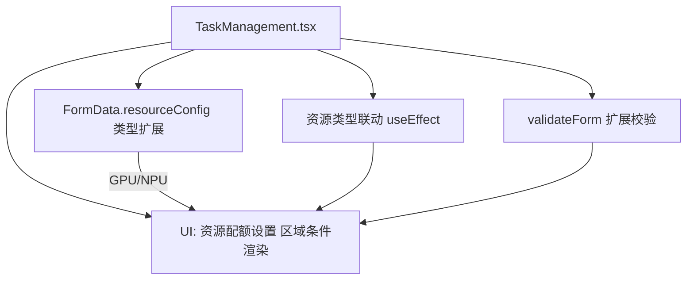

# DESIGN — 任务资源配置增强

## 分层设计与核心组件
- 表单状态层：FormData（含 resourceType / resourceConfig）。
- 校验层：validateForm 执行范围检查并更新 formErrors。
- 联动层：useEffect 根据 resourceType 调整 resourceConfig 内存与 acceleratorCards。
- UI 层：资源配额设置区域条件渲染 acceleratorCards。

## 接口契约定义
- 输入：用户在创建/编辑任务时选择资源类型并填写资源参数。
- 输出：提交有效任务；estimatedTime 取自 maxRunTime；其余资源参数仅在前端用于展示与校验。

## 数据流向
- 用户输入 → formData.resourceConfig → validateForm → formErrors → UI 错误提示。
- 用户切换资源类型 → useEffect → 覆写 resourceConfig 部分字段 → UI 刷新。

## 异常处理策略
- JSON 配置错误、资源参数越界：在 formErrors 中设置错误并阻止提交。