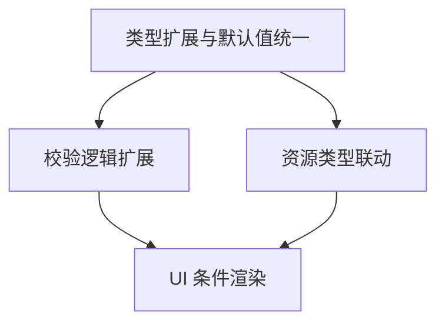

# TASK — 任务资源配置增强

## 原子任务拆分

1) 类型扩展与默认值统一
- 输入契约：现有 FormData 接口；
- 输出契约：resourceConfig.acceleratorCards?: number；默认 memory=32；
- 验收标准：项目编译通过，类型无报错；初始值显示为 32GB；
- 约束：不改 Task 接口结构；
- 依赖：无。

2) 校验逻辑扩展
- 输入契约：formData 资源参数；
- 输出契约：formErrors 增加 resourceAcceleratorCards；
- 验收标准：越界值能阻止提交并显示错误信息；
- 约束：范围 cores[1-32] memory[1-128] maxRunTime[5-2880] acceleratorCards[1-8]；
- 依赖：任务1。

3) 资源类型联动 useEffect
- 输入契约：resourceType（cpu/gpu/npu）；
- 输出契约：CPU 移除 acceleratorCards 且保证 memory≥32；GPU/NPU 默认 acceleratorCards=1；
- 验收标准：切换资源类型时 UI 与状态联动正确；
- 约束：避免不必要重渲染；
- 依赖：任务1。

4) UI 条件渲染与错误样式
- 输入契约：formData.resourceType、formErrors；
- 输出契约：在 GPU/NPU 显示加速卡输入框，错误时红框与提示；
- 验收标准：UI 交互符合一致性；
- 约束：遵循现有样式规范；
- 依赖：任务2、3。

## 任务依赖图

