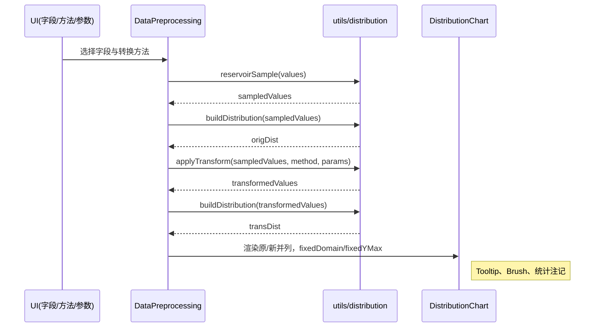

# 阶段2：Architect（架构设计）

## 整体架构图
```mermaid
flowchart TD
  subgraph Panel[DataPreprocessing.numeric_transform 面板]
    A[selectedFields]
    B[method + params]
    C[rawPreviewRows]
  end

  C -->|采样/提取| D[values:number[]]
  D -->|buildDistribution| E[origDist]
  D -->|applyTransform| F[transformedValues]
  F -->|buildDistribution| G[transDist]

  E --> H1[DistributionChart 原始]
  G --> H2[DistributionChart 转换后]

  subgraph Modal[Dialog: 大图预览]
    E2[origDist (大采样)] --> H3
    G2[transDist (大采样)] --> H4
    H3[DistributionChart 原始(Brush)]
    H4[DistributionChart 转换后(Brush)]
  end

  classDef comp fill:#eef,stroke:#99f,stroke-width:1px;
  class H1,H2,H3,H4 comp;
```

## 分层设计与核心组件
- utils/distribution.ts：
  - computeStats、computeHistogram、buildNormalCurve、reservoirSample。
  - 变换：transformLog、transformSqrt、transformBoxCox、transformYeoJohnson、transformQuantileUniform/Normal。
  - applyTransform(values, method, params)、buildDistribution(values, bins?)。
- components/DistributionChart.tsx：
  - props：histogram、stats、domain、height、showBrush、fixedDomain、fixedYMax、color、title、showStats。
  - 渲染：Bar（密度）+ Line（正态曲线），支持 Brush、Tooltip、统计注记。
- DataPreprocessing.tsx：
  - 面板：字段选择、方法/参数选择；缩略图原/新并列；“查看大图”入口。
  - 对话框：更大采样、Brush缩放。

## 模块依赖关系
```mermaid
graph LR
  DataPreprocessing --> DistributionChart
  DataPreprocessing --> utilsDistribution
  DistributionChart --> uiChart
  utilsDistribution --> (无外部依赖)
```

## 接口契约定义（关键）
- buildDistribution(values:number[]):
  - 输入：过滤后的数值数组（采样后）。
  - 输出：{ histogram: HistogramBin[]; stats: StatsSummary; domain:{min,max}; normalCurve }。
- applyTransform(values:number[], method:TransformMethod, params:any):
  - 支持的方法集合与参数说明；返回转换后的数值数组。
- DistributionChart Props：
  - fixedDomain/fixedYMax：用于原/新并列同轴域，避免视觉误导。

## 数据流向图


## 异常处理策略
- 非数值/NaN：在提取/采样阶段剔除。
- 空数组/极端情况：computeHistogram 将退化为单点或默认 30 档；yMax 自动加成 1.15。
- 变换参数非法：applyTransform 返回原值或安全默认（如 λ 缺省）。
- 性能：超大数组时采样；后续引入 Web Worker 时在 DP 中分支执行。

## 设计原则落地
- 与现有架构一致（Radix + Recharts）；复用 ChartContainer；避免过度设计，先不引入 KDE 与 bins 可调。

## 设计可行性验证
- 已在本地集成并启动开发服务器，缩略图与大图预览均可正常交互。