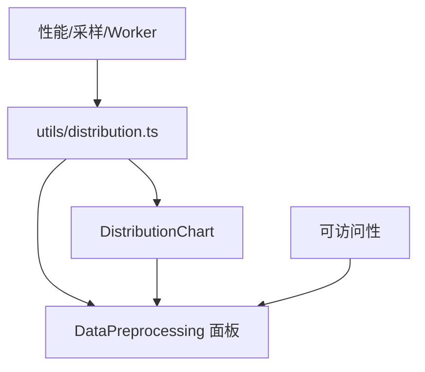

# 阶段3：Atomize（原子化拆分）

## 原子任务列表

1. 分布计算工具（utils/distribution.ts）
   - 输入契约：values:number[]（已过滤数值）；可选 params。
   - 输出契约：统计、直方图、正态曲线、domain，及 applyTransform 的转换结果。
   - 约束：性能优先，支持采样；分箱使用 F–D 规则；变换包含 log/sqrt/box_cox/yeo_johnson/quantile。
   - 验收：运行本地预览，计算在3s内；导出函数被组件正确调用。

2. 图表组件（components/DistributionChart.tsx）
   - 输入契约：histogram、stats、domain、fixedDomain、fixedYMax、showBrush、color、title。
   - 输出契约：渲染直方图密度 + 正态曲线，显示统计注记，支持 Tooltip 与 Brush。
   - 约束：复用 ChartContainer；与 Recharts 版本兼容；保持同轴域对比。
   - 验收：缩略图与大图预览渲染正确；交互无报错。

3. 面板集成（DataPreprocessing.tsx）
   - 输入契约：selectedFields、method、params、rawPreviewRows。
   - 输出契约：缩略图原/新并列；“查看大图”对话框原/新并列；统一轴域；实时更新。
   - 约束：采样 MAX（缩略图15k；大图100k）；quantile 映射为 uniform/normal；风格与现有一致。
   - 验收：选择不同方法与参数，图表即时更新；大图可 Brush；终端无报错。

4. 可访问性与提示
   - 输入契约：无（组件属性与现有文本）。
   - 输出契约：统计注记、Tooltip、键盘与屏幕阅读器描述（增量迭代）。
   - 约束：不破坏现有 UI；ARIA 标签与焦点管理。
   - 验收：基本读屏与键盘可用；后续迭代补充测试用例。

5. 性能与扩展
   - 输入契约：大量 values（≥1e6）。
   - 输出契约：采样结果与分布数据；未来 Web Worker 接口。
   - 约束：前端计算不阻塞主线程；采样优先；Worker 留白接口。
   - 验收：本地 mock 数据验证 ≤3s；Worker 接口预留文档说明。

## 依赖关系（Mermaid）
