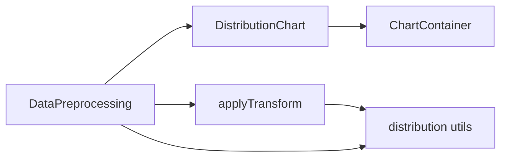
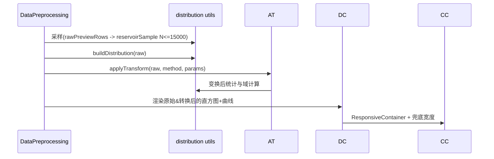

阶段2：Architect（架构设计）——数据转换规则清洗选项

1. 整体架构图
```mermaid
flowchart TD
  A[DataPreprocessing UI]
  A --> B[Field Selector]
  A --> C[Transform Method & Params]
  A --> D[Preview Grid]
  D --> E[DistributionChart]
  E --> F[ChartContainer\n(Recharts ResponsiveContainer + Fallback)]
  A --> G[View Large Dialog]
  A --> H[applyTransform]
  H --> I[distribution utils]
  I --> J[buildHistogram (FD/fallback)]
  I --> K[stats (mean,std,count)]
```

2. 分层设计与核心组件
- UI层：DataPreprocessing（字段选择、方法与参数、预览栅格、查看大图弹窗）；DistributionChart（直方图+正态曲线）；ChartContainer（图表容器与小宽度兜底）。
- 业务层：applyTransform，将不同方法作用于数值数组；
- 工具层：distribution utils（构建直方图、计算统计量、高斯PDF、FD分箱、自适应fallback）。

3. 模块依赖关系


4. 接口契约定义
- DistributionChartProps：
  - histogram: HistogramBin[]
  - stats: { mean:number; std:number; count:number }
  - domain: { min:number; max:number }
  - height?: number (default 180)
  - showBrush?: boolean (default false)
  - fixedDomain?: [number, number]
  - fixedYMax?: number
  - color?: string
  - title?: string
  - showStats?: boolean (default true)
- applyTransform(raw:number[], method, params): number[]
  - method∈{log,sqrt,box_cox,yeo_johnson,quantile_uniform,quantile_normal}
  - 参数验证：域限制与类型校验；非法返回空数组并提示。
- buildDistribution(values:number[]): { histogram: HistogramBin[]; stats; domain }
  - 采用FD规则计算分箱数；样本极小或IQR≈0时回退固定分箱数50。

5. 数据流向图


6. 异常处理策略
- 非数值或NaN：在采样与分布构建时忽略并计数提示。
- 参数非法：阻止保存并显示中文提示，不触发变换或返回空数组。
- 容器过窄：ChartContainer使用数值尺寸兜底（如640×240）并启用横向滚动，确保可读。
- 极端分布：IQR接近0导致FD分箱异常时回退固定分箱数；yMax采用两者最大密度×1.15。

7. 设计可行性与与现有系统一致性
- 复用现有组件与模式（DistributionChart、ChartContainer、Select、Dialog等），与项目风格一致；性能与响应式策略已在现有代码验证。