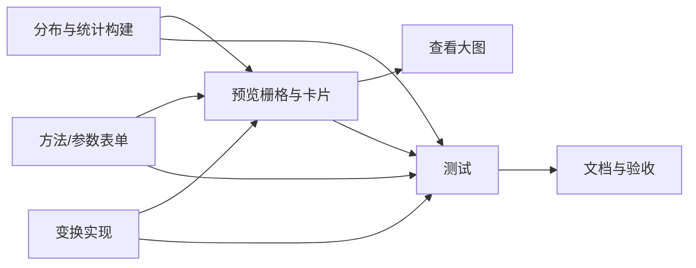

阶段3：Atomize（原子化任务拆分）——数据转换规则清洗选项

总览：以下任务均可独立验证，包含输入/输出契约、实现约束与依赖关系，最后附依赖图。

任务1：方法选择与参数表单
- 输入契约：可选字段列表；当前规则对象（method, params）。
- 输出契约：更新后的规则配置（method与params）；参数校验提示。
- 实现约束：
  - log（默认base=e，不开放UI参数）；sqrt（无参）；box_cox/yeo_johnson（λ可空表示自动）；quantile（nQuantiles默认100、范围1–1000，outputDistribution∈{uniform,normal}）。
- 验收：切换与输入后UI状态正确、禁用非法保存、提示文案准确。

任务2：分布预览栅格与卡片布局
- 输入契约：selectedFields、rawPreviewRows。
- 输出契约：缩略图卡片（原始与转换后分布）。
- 实现约束：repeat(auto-fit,minmax(≥280px,1fr))；卡片内部 w-full min-w-0；ChartContainer兜底宽度启用。
- 验收：窄容器不挤压，极窄触发横向滚动；多字段时栅格自适应列数。

任务3：分布与统计构建
- 输入契约：数值数组（采样后）。
- 输出契约：{histogram, stats, domain}。
- 实现约束：
  - reservoirSample N<=15000；FD分箱，自适应；IQR≈0或N极小回退分箱=50。
  - stats包含mean,std,count；domain为[min,max]。
- 验收：统计与直方图正确；小样本与极端分布下可读性良好。

任务4：变换实现
- 输入契约：raw:number[]、method、params。
- 输出契约：trans:number[]。
- 实现约束：log/sqrt/box_cox/yeo_johnson/quantile_uniform/quantile_normal；域与参数校验。
- 验收：各方法在合法域内输出正确；非法输入返回空数组并提示。

任务5：查看大图弹窗
- 输入契约：选中字段、原始与转换后分布。
- 输出契约：两图并排或栅格；统一域范围与yMax；可选Brush开关。
- 实现约束：DialogContent 尺寸与滚动；性能友好。
- 验收：对比清晰，Brush开关正常，关闭时无异常。

任务6：测试与验证
- 输入契约：utils与组件。
- 输出契约：单元测试与集成测试结果。
- 实现约束：
  - utils测试：FD分箱、统计、quantile映射、Yeo-Johnson/Box-Cox边界。
  - 组件测试：参数联动、预览渲染、极窄容器兜底、弹窗对比。
- 验收：全部测试通过，覆盖率达到约定标准（核心逻辑至少80%）。

任务7：文档与验收
- 输入契约：PRD与设计文档。
- 输出契约：ACCEPTANCE与FINAL文档；TODO清单。
- 实现约束：与现有文档结构一致；中文说明准确。
- 验收：文档完整、一致、可追溯。

任务依赖图
